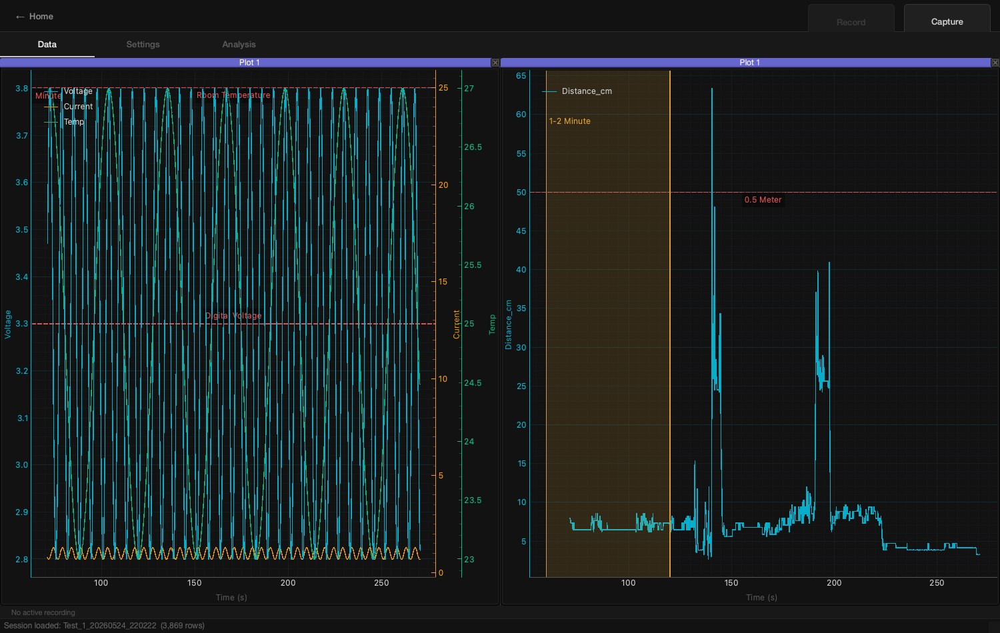
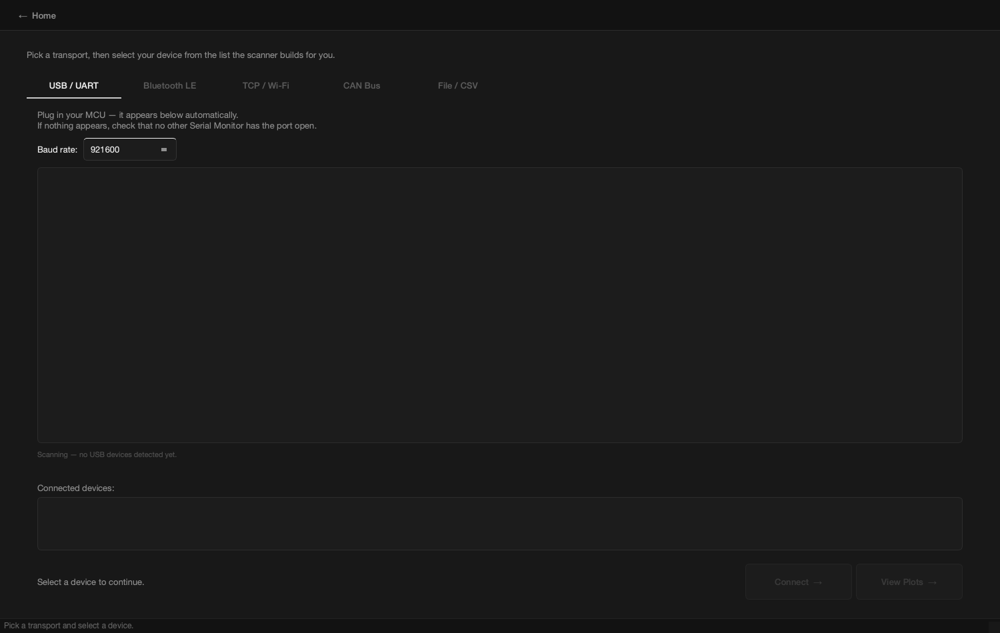
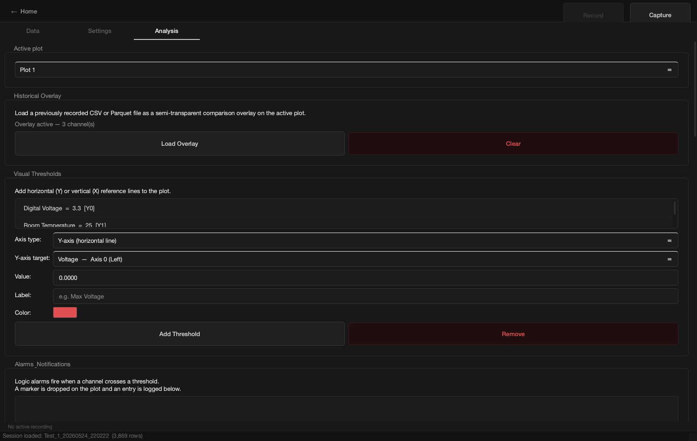

# Multi-Protocol Bus Analyzer

An open-source desktop tool that captures live traffic over **CAN, UART/Serial,
BLE, and TCP/Wi-Fi**, decodes each protocol into named signals, and plots them
in real time. Recorded sessions are logged to CSV/Parquet and reopened for
post-test analysis with SciPy-backed filtering and statistics.

Built with Python + PySide6 (Qt) and pyqtgraph, with optional GPU rendering via
VisPy for high-channel-count / high-rate streams.



---

## About

Instrumentation and hardware bring-up usually means juggling several
single-purpose tools — one for the serial monitor, another for the CAN bus,
a third for BLE, and a spreadsheet for the logs afterwards. **Multi-Protocol
Bus Analyzer** collapses that workflow into one application:

- Connect to a device over any supported transport and see decoded channels
  streaming on a multi-axis plot within seconds.
- Drop thresholds, alarms, and time-region markers on the live view.
- Record a run to a self-contained session folder, then reopen it later with
  the exact same layout for offline analysis.

All streams share a single PC-monotonic clock so multiple devices on different
transports line up on one time base.

---

## Features

**Multi-protocol capture**
- USB / UART serial (`pyserial`)
- Bluetooth Low Energy (`bleak`)
- CAN bus with DBC decoding into named signals (`python-can` + `cantools`)
- TCP / Wi-Fi sockets
- CSV / Parquet file replay for post-analysis
- Auto-detection of the line protocol (key:value, CSV, and framed formats)

**Real-time visualization**
- 60 Hz multi-axis plotting (`pyqtgraph`), independent Y-axes per signal
- Optional GPU-accelerated renderer (`VisPy` / OpenGL) for high-rate streams
- Live math channels (e.g. `Power = Voltage * Current`) evaluated with `numexpr`
- Visual thresholds, logic alarms, vertical time markers, and region tags
- Live-values digital readout dock

**Analysis & DSP** (`engine/analysis.py`, SciPy)
- Moving average, RMS, peak detection, histogram, correlation
- FFT and spectrogram
- Formula engine for derived channels
- Historical overlay: load a past run as a semi-transparent comparison layer

**Recording & sessions**
- Record to CSV or Parquet (`pandas` / `pyarrow`)
- Self-contained session folders that restore plots, axes, and layout on reload

**Notifications**
- Slack / Teams incoming-webhook alerts when an alarm fires (see
  [SLACK_TEAMS_SETUP.txt](SLACK_TEAMS_SETUP.txt))

**Companion firmware** (`mcu_firmware/`)
- STM32 (Blue Pill) CAN sensor rig in C, with a matching DBC file
- ESP32 BLE and Wi-Fi example sketches, and an Arduino DHT11 sketch

---

## Screenshots

| Connection — pick a transport | Live plotting workspace |
|---|---|
|  |  |

| Analysis: thresholds, overlay, alarms |
|---|
|  |

---

## Getting started

Requires **Python 3.11+**.

```bash
git clone <your-repo-url>
cd Multi-Protocol-Bus-Analyzer

python -m venv .venv
source .venv/bin/activate        # Windows: .venv\Scripts\activate

pip install -r requirements.txt
python main.py
```

### Try it without hardware

The repo ships a sample recording. From the launch screen choose
**Post-Analysis** and open the `Test_1_20260524_220222/` folder to explore a
real two-device (Serial + BLE) session with plots, thresholds, and region tags
already configured.

---

## Project layout

```
engine/          Transport streamers, ring buffers, DSP, recording, sessions
  ble_stream.py      BLE ingestion
  can_stream.py      CAN ingestion + DBC decode
  tcp_stream.py      TCP/Wi-Fi ingestion
  telemetry_stream.py  Serial/UART ingestion
  file_stream.py     CSV/Parquet replay
  analysis.py        SciPy/NumPy DSP functions
  data_logger.py     CSV/Parquet writers
  session*.py        Session config + folder (de)serialization
ui/              PySide6 UI (launch, connection, workspace, plots, settings)
mcu_firmware/    STM32 / ESP32 / Arduino companion firmware + DBC
tests/           Pytest suite
main.py          Application entry point
```

---

## Testing

```bash
pip install pytest
QT_QPA_PLATFORM=offscreen python -m pytest tests/ -q
```

The suite covers protocol auto-parsing, the CAN stream, session-folder
round-tripping, the digital dashboard, and webhook notifications.

---

## Tech stack

Python · PySide6 (Qt) · pyqtgraph · VisPy/OpenGL · NumPy · SciPy · pandas ·
PyArrow · pyserial · bleak · python-can · cantools · numexpr ·
pytest · C (STM32) · C++ (ESP32/Arduino)

## License

MIT
